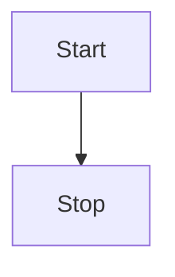

# CLI Presenter

A powerful, developer-friendly presentation tool for the terminal and web. Write slides in Markdown, present in the terminal (TUI), and export to beautiful HTML or PDF.

## Installation

```bash
pip install cli-presenter
```

### Optional Dependencies
For automated PDF export, install `playwright`:
```bash
pip install playwright
playwright install
```

## Quick Start

1. **Initialize a Project**:
   ```bash
   cli-presenter init
   ```
   This generates:
   - `template.md`: A starter slide deck.
   - `theme.tcss`: Styles for the Terminal UI.
   - `template.css`: Styles for HTML/PDF export.

2. **Present**:
   ```bash
   cli-presenter template.md
   ```
   Navigate with **Space** / **Arrow Keys**. Press **Q** to quit.

3. **Export**:
   ```bash
   cli-presenter export template.md
   ```
   Open `presentation.html` in your browser.

## Slide Syntax

Authentication follows standard Markdown with a `---` separator.

### Metadata
You can add `key: value` pairs at the very top of any slide.

```markdown
layout: title
logo: /path/to/logo.png
# My Presentation Title

---
layout: center
# Centered Content
```

#### Supported Metadata Keys
- **layout**: Controls the visual arrangement of the slide.
    - `default`: Standard top-down flow.
    - `center`: Centers content vertically and horizontally.
    - `title`: Inverted colors (dark background), centered, large text.
- **logo**: Path or URL to an image. Displayed in the top-right corner (HTML/PDF only).

## Rich Content

### Mermaid Diagrams
You can include Mermaid graphs directly in your Markdown. They will render automatically in the HTML/PDF export.

```markdown

```

### Images
Standard Markdown image syntax works in both TUI (if terminal supports it, otherwise generic placeholder) and HTML.
```markdown

```

## Styling

### Terminal (TUI)
Edit `theme.tcss` to change colors and fonts in the terminal. It uses [Textual CSS](https://textual.textualize.io/guide/CSS/).

```css
/* Example theme.tcss */
SlideWidget {
    background: #1e1e1e;
    color: #e0e0e0;
}
.layout-title {
    background: #bb86fc;
    color: #000;
}
```

### HTML / PDF
Edit `template.css` to control the specific look of the exported file.

```css
/* Example template.css */
@page { size: 1920px 1080px; }
.slide { 
    font-family: 'Helvetica', sans-serif;
    background: linear-gradient(135deg, #f5f7fa 0%, #c3cfe2 100%);
}
```

## Exporting

### To HTML
```bash
cli-presenter export my_deck.md --output final.html
```
This generates a standalone HTML file with embedded navigation scripts.

### To PDF
There are two ways to generate a PDF:

1. **Manual (Recommended)**: 
   Export to HTML, open in Chrome/Edge/Safari, and select **Print -> Save as PDF**. Ensure "Background Graphics" is enabled.

2. **Automated (Requires Playwright)**:
   ```bash
   cli-presenter export my_deck.md --pdf --output final.pdf
   ```
   This uses a headless browser to generate the PDF automatically.
